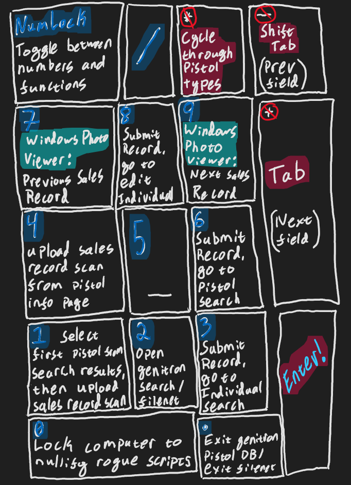

# MiPistol Job Automation

After getting my first office job, I quickly realised that it's nothing like the personality-defining show on Netflix. The only similarity between working for the Michigan State Police Firearms Records Unit and \_\_Mifflin\_\_ is the massive amount of paper that has to be processed.

MiPistol is the poorly maintained database that warehouses every handgun transaction in the state of Michigan. Luckily, its predictibly horrible user interface can be trudged through via a AutoHotkey script I wrote, which makes my meaningless job of processing already processed pistol sales records slightly less numbing!

I'll later write some documentation in LaTeX for people who read my resume to jizz their pants over, but for now, check out this diagram:

